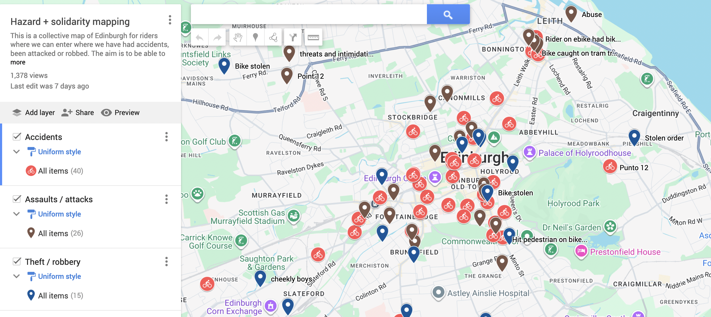

# Why collective mapping for organising?

# What to map

The first step is to have a collective conversation to identify what it is that would be useful for us to map. With food delivery gig work in Edinburgh, a big topic is risk: many riders have experiences of getting their bikes stolen, being hit by cars, or being attacked while on the job. Some of these stories have made the rounds and everyone is aware that there are dangers involved. At the same time, politicians in the UK and in Edinburgh are talking a lot about food delivery risks - but what they usually mean is risks they say are *caused* by riders (because of e.g. reckless driving); they never talk of risks *faced* by riders, and no data is collected on accidents that distinguish gig workers who were injured while working delivery or private rides. As workers, we know that these things happen and we often have a good sense of which areas are riskier. But beyond our intuition and the information we get from talking to other riders, we don't have data to back us up and help us show how often and where and what kind of risks riders encounter in the city.

It is never possible to map everything: we need to decide what is most important, and we need to agree on some categories that make sense to us - even if they will lose some of the details of the stories we want to tell. So firstly we need to have a collective space and a conversation amongst workers for us to identify and decide what those important categories are that we want to map. In the case of Edinburgh food delivery riders, we landed on 1/ accidents, 2/thefts (including stolen bikes and stolen delivery food) and 3/attacks. We also thought it could be good to map bad restaurants - those that make riders wait a lot or don't treat riders with respect.

# How to map:

It's possible to create a collective map just with some post-its and an actual paper map. If we are all in the room together, we can write a little description of what happened to us on post-its of different colours (for different risk categories) and stick them to the map. But if we want to scale that up to a digital tool that more people can use and that can help us see and collect more spatial data, then we need a different approach.

We used Google My Maps for this; it's a simple, free tool and only requires a Google account. In an ideal world, it would be better not to use Google, and we may find other and better ways to do this in the future. But this is what we had for this. Google My Maps allows you to create your own map (in our case, Edinburgh) and to add your own pins to the map. You can create different categories of pins (in our case: "accidents", "thefts", "attacks", "bad restaurants" and "other shit that happened"), and you can use the "share link" option to make your collaborative map available to others, who can then add more pins.




```{r setup, include=FALSE}
knitr::opts_chunk$set(eval = FALSE,
                      echo = FALSE,
                      warning = FALSE,
                      message = FALSE)
```

```{r}
library(dplyr, warn.conflicts = FALSE)
library(ggplot2)
library(kableExtra)
```

## Data

For the background data of to map Edinburgh, I use Stadia Maps via the ggmap package. see: \href{https://dkahle.r-universe.dev/ggmap}{https://dkahle.r-universe.dev/ggmap}. Registration is free and gives access to the API, through which you can download map tiles.

```{r}
# use command usethis::edit_r_environ to see and edit your .Renviron files

library("ggmap")
# registering stadia API key
register_stadiamaps(Sys.getenv("MY_API_KEY"), write = FALSE)
# to register your API key into your system environment, you will need to use the package {usethis} and {rscorecard}. You can also just hardcode it into your code directly above (instead of 'MY_API_KEY", just copy-paste the content of your API key directly) but that's not best practice, and you won't be able to share your code.

#library(rscorecard)
#sc_keys(Sys.getenv("MY_API_KEY"))


# TO DO: add a path to google my map data in the .Renviron file so you don't hardcode that data or the data path

# Edinburgh coordinates
bbox <- c(left = -3.30, bottom = 55.91, right = -3.10, top = 55.99)
edi_map <- get_stadiamap(bbox, zoom = 14, maptype = "stamen_toner_lite")

# ggmap(edi_map)
```

Workers' Observatory data: Edinburgh riders collective risk mapping project

During our first mapping workshop, Edinburgh food delivery riders discussed risks and issues they faced at work. They worked together to identify different risks and then started reporting them on the collaborative Edinburgh map I had set up using Google My Maps. I downloaded the kml data straight from the Google My Maps (Google My Maps allows you to save the data as kml, rather than kmz). When designing the map with the riders, we have split things into different kinds of risks (accidents, thefts/robbery, attacks + bad restaurants, other risks)

```{r}
# turn kml data into tidy data using tidykml
library(tidykml)
library(stringr)

# accident data
accidents_points <- kml_points(Sys.getenv(paste0(filepath_ggmaps_WO),"accidents.kml")) %>%
  mutate(description_full = tolower(paste(name, description))) %>%
  select(description_full, longitude, latitude)

#use stringr to identify all instances where description_full includes the string "stole" 
accidents_points_data <- accidents_points %>%
  mutate(theft = ifelse(str_detect(description_full, "stole"), 1, 0),
         attack = ifelse(str_detect(description_full, "attack|abuse|harass"), 1, 0)) %>%
  mutate(accident = ifelse(theft == 0 & attack == 0, 1, 0))
```

```{r}
# attack data
attack_points <- kml_points("attacks.kml") %>%
  mutate(description_full = tolower(paste(name, description))) %>%
  select(description_full, longitude, latitude)

#use stringr to identify all instances where description_full includes the string "stole" 
attack_points_data <- attack_points %>%
  mutate(theft = ifelse(str_detect(description_full, "bike stolen"), 1, 0)) %>%
  mutate(attack = ifelse(theft == 0, 1, 0),
         accident = 0)
```

```{r}
# theft/robbery data
theft_point <- kml_points("theft.kml") %>%
  mutate(description_full = tolower(paste(name, description))) %>%
  select(description_full, longitude, latitude)

#use stringr to identify all instances where description_full includes the string "stole" 
theft_points_data <- theft_point %>%
  mutate(attack = ifelse(str_detect(description_full, "robbery"), 1, 0)) %>%
  mutate(theft = ifelse(attack == 0, 1, 0),
         accident = 0)
```

```{r bind}
hazard_data <- bind_rows(accidents_points_data, attack_points_data, theft_points_data) %>%
  rename(lon = longitude,
         lat = latitude)
```

```{r}
accidents_plot <- hazard_data %>%
  filter(accident == 1)
```

## Analysis

```{r}
library("patchwork")
library("ggdensity")
library("geomtextpath")

accident_map <- ggmap(edi_map) +
  geom_point(data = accidents_plot, color = "red")
```

```{r}
hdr_map <- ggmap(edi_map) + 
  geom_hdr(
    aes(lon, lat, fill = after_stat(probs)), data = accidents_plot,
    alpha = .5
  ) + #+
  #geomtextpath::geom_labeldensity2d(
    #aes(lon, lat, level = after_stat(probs)),
    #data = accidents_plot, stat = "hdr_lines", size = 3, boxcolour = NA
  #) +
  scale_fill_brewer(palette = "YlOrRd") +
  theme(legend.position = "none")

(accident_map + hdr_map + 
   plot_annotation(title = "Accidents reported by food delivery riders",
                   caption = "Data source: Riders Hazard Mapping project (Google My Maps)\nVisualization: Marion Lieutaud | Workers' Observatory")) & 
  theme(axis.title = element_blank(), 
        axis.text = element_blank(), 
        axis.ticks = element_blank(),
        plot.caption = element_text(size = 6))
```

```{r, include=FALSE}
hazard_data %>%
  filter(accident == 1) %>%
  select(description_full) %>%
  kable()
```

```{r}
theft_plot <- hazard_data %>%
  filter(theft == 1) 

theft_map <- ggmap(edi_map) +
  geom_point(data = theft_plot, color = "blue")
```

```{r}
hdr_theft_map <- ggmap(edi_map) + 
  geom_hdr(
    aes(lon, lat, fill = after_stat(probs)), data = theft_plot,
    alpha = .5
  ) + 
  scale_fill_brewer(palette = "GnBu") +
  theme(legend.position = "none")

(theft_map + hdr_theft_map + 
   plot_annotation(title = "Thefts faced by food delivery riders",
                   caption = "Data source: Riders Hazard Mapping project (Google My Maps)\nVisualization: Marion Lieutaud | Workers' Observatory")) & 
  theme(axis.title = element_blank(), 
        axis.text = element_blank(), 
        axis.ticks = element_blank(),
        plot.caption = element_text(size = 6))
```

```{r, include = FALSE}
hazard_data %>%
  filter(theft == 1) %>%
  select(description_full) %>%
  kable()
```

```{r}
# scatterplot
attack_plot <- hazard_data %>%
  filter(attack == 1) 

attack_map <- ggmap(edi_map) +
  geom_point(data = attack_plot, color = "purple")
```

```{r}
# density map
hdr_attack_map <- ggmap(edi_map) + 
  geom_hdr(
    aes(lon, lat, fill = after_stat(probs)), data = attack_plot,
    alpha = .5
  ) + 
  scale_fill_brewer(palette = "Purples") +
  theme(legend.position = "none")
```

```{r}
(attack_map + hdr_attack_map + 
   plot_annotation(title = "Attacks against food delivery riders",
                   caption = "Data source: Riders Hazard Mapping project (Google My Maps)\nVisualization: Marion Lieutaud | Workers' Observatory")) & 
  theme(axis.title = element_blank(), 
        axis.text = element_blank(), 
        axis.ticks = element_blank(),
        plot.caption = element_text(size = 6))
```

```{r, include=FALSE}
hazard_data %>%
  filter(attack == 1) %>%
  select(description_full) %>%
  kable()
```

```{r}
ggmap(edi_map) +
  geom_point(data = accidents_plot, color = "red") +
  geom_point(data = theft_plot, color = "blue") +
  geom_point(data = attack_plot, color = "purple") +
  geom_hdr(
    aes(lon, lat, fill = after_stat(probs)), data = hazard_data,
    alpha = .5
  ) + 
  scale_fill_brewer(palette = "OrRd") +
  theme(legend.position = "none",
        axis.title = element_blank(), 
        axis.text = element_blank(), 
        axis.ticks = element_blank(),
        plot.caption = element_text(size = 6)) 
```

## Some additional useful resources

\href{https://sarahlistabarth.github.io/blog/posts/opening-kmz-files/}{https://sarahlistabarth.github.io/blog/posts/opening-kmz-files/} \newline \href{https://ratey-atuwa.github.io/Learn-R-web/google-kml.html}{https://ratey-atuwa.github.io/Learn-R-web/google-kml.html}
