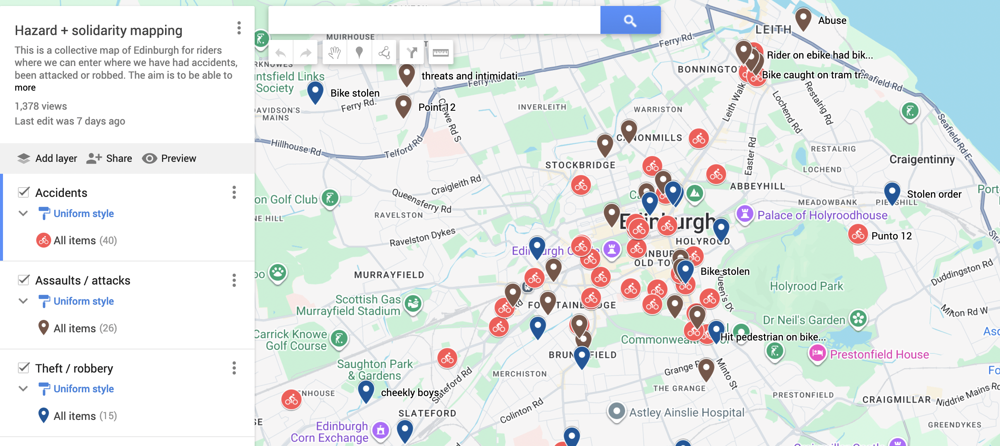

# Why collective mapping for organising?

# What to map

The first step is to have a collective conversation to identify what it is that would be useful for us to map. With food delivery gig work in Edinburgh, a big topic is risk: many riders have experiences of getting their bikes stolen, being hit by cars, or being attacked while on the job. Some of these stories have made the rounds and everyone is aware that there are dangers involved. At the same time, politicians in the UK and in Edinburgh are talking a lot about food delivery risks - but what they usually mean is risks they say are *caused* by riders (because of e.g. reckless driving); they never talk of risks *faced* by riders. No data is collected on accidents that could allow us to identify gig workers who were injured while working delivery or private rides. As workers, we know that these things happen and we often have a good sense of which areas are riskier. But beyond our intuition and the information we get from talking to other riders, we don't have data to back us up and help us show how often and where and what kind of risks riders encounter in the city.

It is never possible to map everything: we need to decide what is most important, and we need to agree on some categories that make sense to us - even if they will lose some of the details of the stories we want to tell. So firstly we need to have a collective space and a conversation amongst workers for us to identify and decide what those important things are that we want to map. In the case of Edinburgh food delivery riders, we landed on three categories: 1/ accidents, 2/thefts (including stolen bikes and stolen delivery food) and 3/attacks. We also thought it could be good to map bad restaurants - those that make riders wait a lot or don't treat riders with respect.

# How to map:

It's possible to create a collective map just with some post-its and an actual paper map. If we are all in the room together, we can write a little description of what happened to us on post-its of different colours (for different risk categories) and stick them to the map. But if we want to scale that up to a digital tool that more people can use and that can help us see and collect more spatial data, then we need a different approach.

In the first instance, we used Google My Maps for this; it's a simple, free tool and only requires a Google account. In an ideal world, it would be better not to use Google, and we may find other and better ways to do this in the future. But this is what we had for this. Google My Maps allows you to create your own map (in our case, Edinburgh) and to add your own pins to the map. You can create different categories of pins (in our case: "accidents", "thefts", "attacks", "bad restaurants" and "other shit that happened"), and you can use the "share link" option to make your collaborative map available to others, who can then add more pins.




```{r setup, include=FALSE}
knitr::opts_chunk$set(eval = FALSE,
                      echo = FALSE,
                      warning = FALSE,
                      message = FALSE)
```

```{r}
library(dplyr, warn.conflicts = FALSE)
library(ggplot2)
library(kableExtra)
```

## Data

For the background map for Edinburgh or London, we can use Stadia Maps via the ggmap package. see: \href{https://dkahle.r-universe.dev/ggmap}{https://dkahle.r-universe.dev/ggmap}. Registration is free and gives access to the API, through which you can download map tiles.

```{r}
# use command usethis::edit_r_environ to see and edit your .Renviron files

library("ggmap")
# registering stadia API key
register_stadiamaps(Sys.getenv("MY_API_KEY"), write = FALSE)
# to register your API key into your system environment, you will need to use the package {usethis} and {rscorecard}. You can also just hardcode it into your code directly above (instead of 'MY_API_KEY", just copy-paste the content of your API key directly) but that's not best practice, and you won't be able to share your code.

#library(rscorecard)
#sc_keys(Sys.getenv("MY_API_KEY"))


# TO DO: add a path to google my map data in the .Renviron file so you don't hardcode that data or the data path

# Edinburgh coordinates
bbox <- c(left = -3.30, bottom = 55.91, right = -3.10, top = 55.99)
edi_map <- get_stadiamap(bbox, zoom = 14, maptype = "stamen_toner_lite")

# ggmap(edi_map)
```

Workers' Observatory data: Edinburgh riders collective risk mapping project

During our first mapping workshop, Edinburgh food delivery riders discussed risks and issues they faced at work. They worked together to identify different risks and then started reporting them on the collaborative Edinburgh map I had set up using Google My Maps. I downloaded the kml data straight from the Google My Maps (Google My Maps allows you to save the data as kml, rather than kmz). When designing the map with the riders, we have split things into different kinds of risks (accidents, thefts/robbery, attacks + bad restaurants, other risks)

```{r}
# turn kml data into tidy data using tidykml
library(tidykml)
library(stringr)

# accident data
accidents_points <- kml_points(Sys.getenv(paste0(filepath_ggmaps_WO),"accidents.kml")) %>%
  mutate(description_full = tolower(paste(name, description))) %>%
  select(description_full, longitude, latitude)

#use stringr to identify all instances where description_full includes the string "stole" 
accidents_points_data <- accidents_points %>%
  mutate(theft = ifelse(str_detect(description_full, "stole"), 1, 0),
         attack = ifelse(str_detect(description_full, "attack|abuse|harass"), 1, 0)) %>%
  mutate(accident = ifelse(theft == 0 & attack == 0, 1, 0))
```

```{r}
# attack data
attack_points <- kml_points("attacks.kml") %>%
  mutate(description_full = tolower(paste(name, description))) %>%
  select(description_full, longitude, latitude)

#use stringr to identify all instances where description_full includes the string "stole" 
attack_points_data <- attack_points %>%
  mutate(theft = ifelse(str_detect(description_full, "bike stolen"), 1, 0)) %>%
  mutate(attack = ifelse(theft == 0, 1, 0),
         accident = 0)
```

```{r}
# theft/robbery data
theft_point <- kml_points("theft.kml") %>%
  mutate(description_full = tolower(paste(name, description))) %>%
  select(description_full, longitude, latitude)

#use stringr to identify all instances where description_full includes the string "stole" 
theft_points_data <- theft_point %>%
  mutate(attack = ifelse(str_detect(description_full, "robbery"), 1, 0)) %>%
  mutate(theft = ifelse(attack == 0, 1, 0),
         accident = 0)
```

```{r bind}
hazard_data <- bind_rows(accidents_points_data, attack_points_data, theft_points_data) %>%
  rename(lon = longitude,
         lat = latitude)
```

```{r}
accidents_plot <- hazard_data %>%
  filter(accident == 1)
```


```{r Analysis}
library("patchwork")
library("ggdensity")
library("geomtextpath")

accident_map <- ggmap(edi_map) +
  geom_point(data = accidents_plot, color = "red")
```

```{r}
hdr_map <- ggmap(edi_map) + 
  geom_hdr(
    aes(lon, lat, fill = after_stat(probs)), data = accidents_plot,
    alpha = .5
  ) + #+
  #geomtextpath::geom_labeldensity2d(
    #aes(lon, lat, level = after_stat(probs)),
    #data = accidents_plot, stat = "hdr_lines", size = 3, boxcolour = NA
  #) +
  scale_fill_brewer(palette = "YlOrRd") +
  theme(legend.position = "none")

(accident_map + hdr_map + 
   plot_annotation(title = "Accidents reported by food delivery riders",
                   caption = "Data source: Riders Hazard Mapping project (Google My Maps)\nVisualization: Marion Lieutaud | Workers' Observatory")) & 
  theme(axis.title = element_blank(), 
        axis.text = element_blank(), 
        axis.ticks = element_blank(),
        plot.caption = element_text(size = 6))
```

```{r, include=FALSE}
hazard_data %>%
  filter(accident == 1) %>%
  select(description_full) %>%
  kable()
```

```{r}
theft_plot <- hazard_data %>%
  filter(theft == 1) 

theft_map <- ggmap(edi_map) +
  geom_point(data = theft_plot, color = "blue")
```

```{r}
hdr_theft_map <- ggmap(edi_map) + 
  geom_hdr(
    aes(lon, lat, fill = after_stat(probs)), data = theft_plot,
    alpha = .5
  ) + 
  scale_fill_brewer(palette = "GnBu") +
  theme(legend.position = "none")

(theft_map + hdr_theft_map + 
   plot_annotation(title = "Thefts faced by food delivery riders",
                   caption = "Data source: Riders Hazard Mapping project (Google My Maps)\nVisualization: Marion Lieutaud | Workers' Observatory")) & 
  theme(axis.title = element_blank(), 
        axis.text = element_blank(), 
        axis.ticks = element_blank(),
        plot.caption = element_text(size = 6))
```

```{r, include = FALSE}
hazard_data %>%
  filter(theft == 1) %>%
  select(description_full) %>%
  kable()
```

```{r}
# scatterplot
attack_plot <- hazard_data %>%
  filter(attack == 1) 

attack_map <- ggmap(edi_map) +
  geom_point(data = attack_plot, color = "purple")
```

```{r}
# density map
hdr_attack_map <- ggmap(edi_map) + 
  geom_hdr(
    aes(lon, lat, fill = after_stat(probs)), data = attack_plot,
    alpha = .5
  ) + 
  scale_fill_brewer(palette = "Purples") +
  theme(legend.position = "none")
```

```{r}
(attack_map + hdr_attack_map + 
   plot_annotation(title = "Attacks against food delivery riders",
                   caption = "Data source: Riders Hazard Mapping project (Google My Maps)\nVisualization: Marion Lieutaud | Workers' Observatory")) & 
  theme(axis.title = element_blank(), 
        axis.text = element_blank(), 
        axis.ticks = element_blank(),
        plot.caption = element_text(size = 6))
```

```{r, include=FALSE}
hazard_data %>%
  filter(attack == 1) %>%
  select(description_full) %>%
  kable()
```

```{r}
ggmap(edi_map) +
  geom_point(data = accidents_plot, color = "red") +
  geom_point(data = theft_plot, color = "blue") +
  geom_point(data = attack_plot, color = "purple") +
  geom_hdr(
    aes(lon, lat, fill = after_stat(probs)), data = hazard_data,
    alpha = .5
  ) + 
  scale_fill_brewer(palette = "OrRd") +
  theme(legend.position = "none",
        axis.title = element_blank(), 
        axis.text = element_blank(), 
        axis.ticks = element_blank(),
        plot.caption = element_text(size = 6)) 
```

## Template mapping workshop structure (IWGB Drivers Branch draft)

\begin{itemize}
  \item Ice breakers (15 min)
  Introduce yourself, what we have done in Scotland
  Drivers introduce themselves
  What brings you here today
  \item General discussion (1.5h)
  we are bringing stuff that we have designed with riders in Edinburgh, where a big issue was risk, hence risk-mapping
  anti-eviction mapping project / London Renters Union
  emergency button on rider app in Brazil
  mapping our work in the city - what happens where, why is it important to us (understand / communicate / denounce)
  \begin{itemize}
    \item What are the risks you face at work?
    \item Where do they happen? What areas of the city feel safe/unsafe? Why?
    \item Break-outs to discuss specific risks (e.g. accidents, thefts, attacks) and to identify categories of risks that make sense to workers. Prepare post-its with specific events and spaces.
    \item what is most important to map? What are the main dangers? What mapping information would be useful for organising? 
    \item Where do we need support - where do we find support?
    \item Discussion of the paper map and main mapping categories
    \item Physical mapping (paper map and post-its)
    \end{itemize}
  \item Break (15 min)
  \item Online mapping: data infrastructure and design (1.5h)
  \begin{itemize}
    \item Why online mapping? Why scaling up?
    \item Introduction to the online mapping tool (e.g. Google My Maps)
    \item Collective agreement on reporting categories and map design
    \item Workers individually report the various events/risks they have faced
    \item Visualisation and open discussion among workers of the results: what landscape of risks and support are we seeing emerging? What might that mean for us?  Is this what you expected? What are the pressure points?
    \item Where do we need support? What kind of support? Where can we find this? Where (and how) can we build this support - hubs, mutual aid, community connections and support. Different possibilities: support/hubs paper-based (vs risk-mapping open access and live), waiting for a two-tiered platform where organisers can access network data. Or duplicated maps (one open-access, one internal for organisers). Or add a positive category to the map ('good places' to e.g. rest, park and sleep for a while).
    \item Map as organising tool - agreement on next steps - Now, you use this to find other riders that may see this as useful. Connect it with what´s happening in Edinburgh. 
    \item Benchmarking: which nightclub treats drivers the worst? Which airport would you avoid if you could?
    \end{itemize}
\end{itemize}

## Outputs

By the end of the workshop, we have a reporting tool that is a useful one for workers, that they have contributed to design and that they are familiar using. We have agreement to use it to engage with other workers and get other folks to use it, and agreement to touch base in 1-2 months and come back with the mapping data results and visualisations. 


## Potential problems

What will we do if we have a mix of delivery riders and Uber drivers? We can split the categories to have a more complex map.
If we have a really split room, we can split in two and bringing them together, and check what risks are facing each group.


# Report on the IWGB private hire branch mapping workshop

## Set-up and attending
IWGB offices
8 drivers present - most of the committee including the chair and Elio (role?). Joe -IWGB researcher - and Pascale - new senior organiser for the private hire branch - were also present as well as a student volunteer. Most of the drivers were in their fifties or older; the majority were migrants from middle-Eastern countries and long-term residents or citizens in the UK. Alex (the IWGB president and courier) was also in the office and took part in some of the conversation. 

## Progression
We introduced ourselves and then Marion talked about the idea of mapping as an organising and campaign tool and gave some examples (anti-eviction mapping project, London Renters Union and the Edinburgh riders hazard map). We talked about how mapping where individual incidents happen can help identify strategic priorities and narratives and shape more local campaigns and demands.  

## Discussion
We moved on to discussing what people in the room identified as the main issues in their work.
The conversation was very active; people in the room had a lot to say about many different issues related to private hire work, most prominently low pay and the organising challenge of a very fragmented workforce. The discussion was intensely political and often high-level and broad in scope. The branch has just gone through a big campaign around TFL licencing - which is both mandatory and can be delayed for months, costing drivers their livelihood and in at least one occasion, their life ().  

Many topics were covered in this broader discussion of work-related issues and risks, including for instance contrats and manoeuvring between Uber and Bolt and the opacity of clients moving between both - with the worst client using Bolt, which does not have as good a vetting or ratting system as Uber. The conversation often came back to the difficulty of taking on platform giants, especially with a platformised and atomised workforce. Organising problems around turnover and people working by themselves came up. A further topic was the question of how to politicise and mobilise the greater IWGB private hire membership (which is large - > 3000 members, overwhelmingly based in London).

Moving between the broad macro-level political conversation to the much more granular and local scale issues necessary for mapping was a bit tricky. Drivers had experienced many different incidents and risks, but these did not seem to feel as important to them; as experienced, long-term organisers, they had knowledge of many things that had happened to others and it did not appear spontaneous (or relevant to them) to switch to reporting what had happened to them. 

With the paper map spread out on the table (thank you to the IWGB comrades who helped print it and lay it out), we switched to small groups (2 people each) and asked all to write down on one colour post-its the big issues, and an other colour post-its different incidents and issues that had happened to them in specific locations (or that they were aware of) and add them to the map. We used the board to then bring together the two levels: firstly the high level (all the big issues) and then the geographically specific issues.

The discussion of the merits of understanding local and geographically specific issues was not without challenge - the branch had not organised local campaigns before and most people present had been focused on transversal issues linked to platforms and platform designs (affecting all platform drivers) or city-level campaign (with TFL). Throughout the discussion, some more local issues emerged, with the identification of other local-level counterparts (e.g. councils). In particular: areas with particularly vindictive approaches to parking (and tickets), unfair fines/penalties and the implementation of impossibly specific driving rules (e.g. no drive through at specific hours or days). These were often linked to specific areas - and councils (notably Islington). The discussion of incident mapping focused on areas where drivers were more likely to come across drunk and/or aggressive clients - especially around areas with lots of clubs and bars. This brought to the surface the necessity of mapping not only geographically but temporally, as drivers would avoid taking clients requests from clubbing areas late in the night, but would not anticipate the same issue for the same area at other hours.

Some of the drivers present were particularly keen from the get-go about using mapping as an organising tool, to identify, keep track and more easily share knowlegde of drivers' hub and waiting areas.Some of the drivers talked about the organising importance of involving women drivers - none were present at the workshop - who are little represented in the branch and in the campaigning. It was supposed that women drivers hung out in specific locations or had their own networks. 

From this conversation we identified two distinct layers of mapping that may be useful to drivers: 

- the first layer was about individual reports for incidents (attacks, unfair fines/tickets etc). This layer could be fully open to all members or maybe the wider public. In fact, it may be possible to deploy it as a mobilising public-facing map for drivers, so that when they experience shocking or infuriating incidents, they know there is at least a place to report them. This could help demonstrate to the greater audience (and to drivers) the prevalence and geographic distribution and density of accidents - it could also help connect drivers around these issues and help shape and focus some local campaigns. 

- the second layer was about workplace mapping but at the scale of the city - mapping areas where many drivers often wait and hang out so as to know where to do outreach, where to leave union resources etc. Initially we discussed having this layer as a sub-category of the main map (the incident map); but the conversation also brought up the question of sensitive data and the potential risks to having such organising data in the open - what if e.g. the police or far-right groups were to use this map to raid drivers' waiting areas or hubs. In addition, we discussed that it was unlikely that people not already actively involved in organising within the union would see the importance or take the time to report social or hanging area. 

We concluded that it would be best to keep these layers distinct, with different access and visibility. The first could be open-access. The second would be organisers-only. In the design of our mapping tool, drivers suggested it would be helpful for such layers (based on different permissions) to be included.


## Technical deployment

On the basis of this discussion, we started building the first map (open-access incident report map). We agreed on 2 main categories: attacks/assaults and fines/penalties; at the request of some folks in the room we added a third more positive category namely "useful info (charging points, loos etc...). 

There were some troubleshooting as google my maps is complicated to use and for a moment, drivers could not add pins to the map. 

Eventually most managed (those who figured it out first helped the others), and we were able to pin and display a number of incidents, which we then discussed. 

We ended the workshop formally there (lunchtime), but I sat up with some of the drivers and we set up the second map (the organisers-only map) and added some of the known drivers' hubs and waiting areas. Several joined in to help with this and by the end we had pinned all the key waiting areas around all London airports and a couple extra throughout the city, which the drivers involved thought very useful.

The private hire branch committee then had a strategy meeting after the workshop (this was planned beforehand)


## Feedback

The drivers and the IWGB staff present seemed on the whole very positive and thanked us a lot. My sense is that the glitching around google my maps was irritating for some and prevented a smoother workflow towards a tool that feels ready to use. 
It seemed to me that the main merit of the workshop for the London Drivers - in addition to setting up a workplace-mapping map that they were interested in - was to create a funnel to go from broad issues and discourse to the shaping of hyperlocal campaigns and strategies. That was the concluding bits of discussion and people seemed quite convinced and galvanised after landing on the idea of a campaign against penalties/fines targeting drivers, perhaps targeting Camden Council. People had a really interesting chat about the merit of having winnable local campaign alongside big campaigns (possibly around self-driving cars).

Charlie (who was in the strategy meeting immediately after the workshop) told me since that he thought the mapping workshop had been very good because the branch had until then really struggled to design and focus strategy and campaigns (hence the strategy workshops) and that after the mapping, they had come and talked right away and very practically and energetically about local campaign against penalties. Joe and Alex gave similar feedback. 

## Reflexions
Google my maps is cheap and open but it is a pain to work with and not remotely streamlined enough. This vindicated the need for a simple incident reporting tool for gig workers.

The workers in the room and the discussion that we had were very different from the Edinburgh riders mapping workshop. The Edinburgh riders were younger, much less political and not (yet) embedded in collective organising. In contrast, the London drivers were older, incredibly experienced organisers, many communists; they were embedded in and committed to militant union organising. They came to this mapping workshop with a a huge amount of knowledge and experience about the issues and the politics of the struggle they are in - they were interested very specifically in how mapping could help them organise and mobilise others. With such audience, it is less about how mapping/data can facilitate politicisation (they are already politicised) and more about how it can serve organising either directly as a organising resource for planning outreach and sharing knowledge between organisers, or indirectly by helping frame and funnel strategic discussions towards actionable and local issues (with different and more accessible opponents - eg council - than the platforms directly).


## Instructions for google my maps

*For the people setting up the map:*

- Make sure that "share on drive - all can edit" is selected

- don't open the link on google maps - copy and paste it in your browser (ideally chrome)

- Click once on "add marker" (the little grey pin item). Then click


*For the people reporting locations/incidents*
How to use the IWGB London Drivers collaborative map to report incidents (attacks/fines/tickets) and useful information for drivers:
https://www.google.com/maps/d/edit?mid=1EB6OLPjRQPhd0dRr9R-ULJN0PfmmVJY&usp=sharing

- copy the link above and paste it into your browser (don't click on it directly, it will open google maps and not the collaborative map (on google my maps), and you won't be able to edit or add incidents). 

- Google chrome works best but other browsers should work too. Log into your google account if you are not yet logged in (only logged users can edit the map).

- Click on "legend" and make sure only the layer you want to edit is selected (e.g. if you want to report an attack, make sure only the "attacks/abuse" layer is selected, and not also the "Fines/tickets/penalties" layer.)

- Then click on the "add marker" button (the little grey pin item in the toolbar at the top).

- Then click on the map where you want to add a pin to report an incident. A box will open where you can add a title and description of the event you want to report. 

- Ideally, give a short description, a rough date and a time for the incident you are reporting.

- Click "save" and your pin will be added to the map. If you made a mistake, click "cancel" and then select the pin you just created and click on the bin item to delete it.


## Some additional useful resources

\href{https://sarahlistabarth.github.io/blog/posts/opening-kmz-files/}{https://sarahlistabarth.github.io/blog/posts/opening-kmz-files/} \newline \href{https://ratey-atuwa.github.io/Learn-R-web/google-kml.html}{https://ratey-atuwa.github.io/Learn-R-web/google-kml.html}
